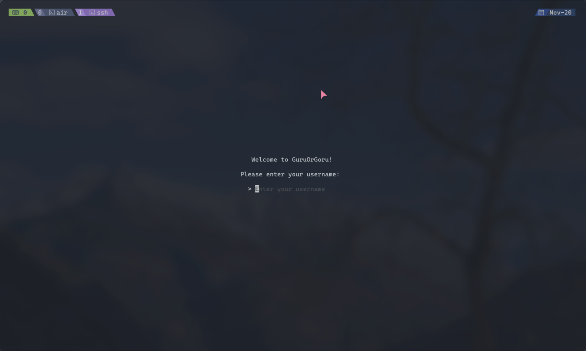
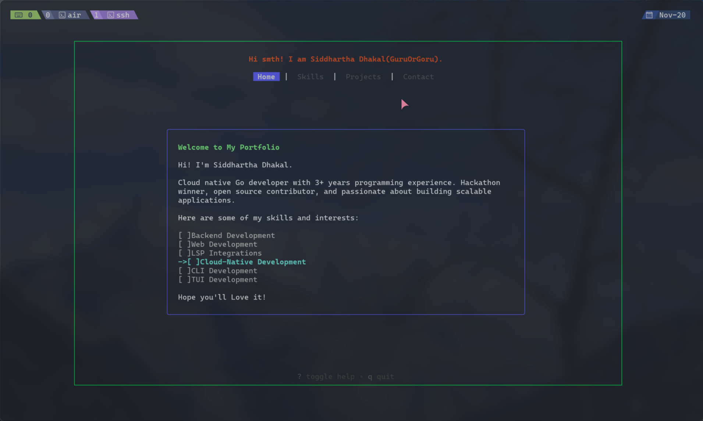
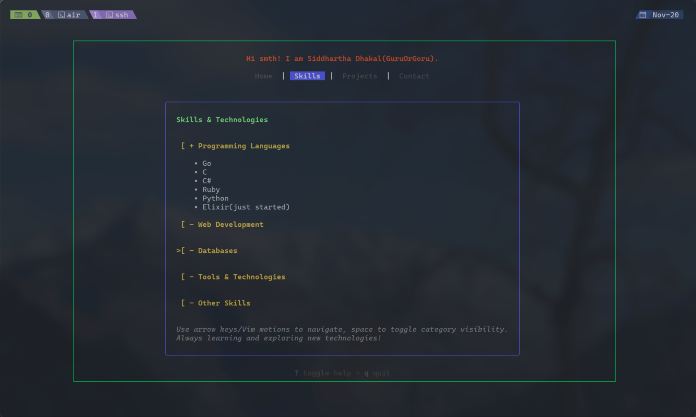
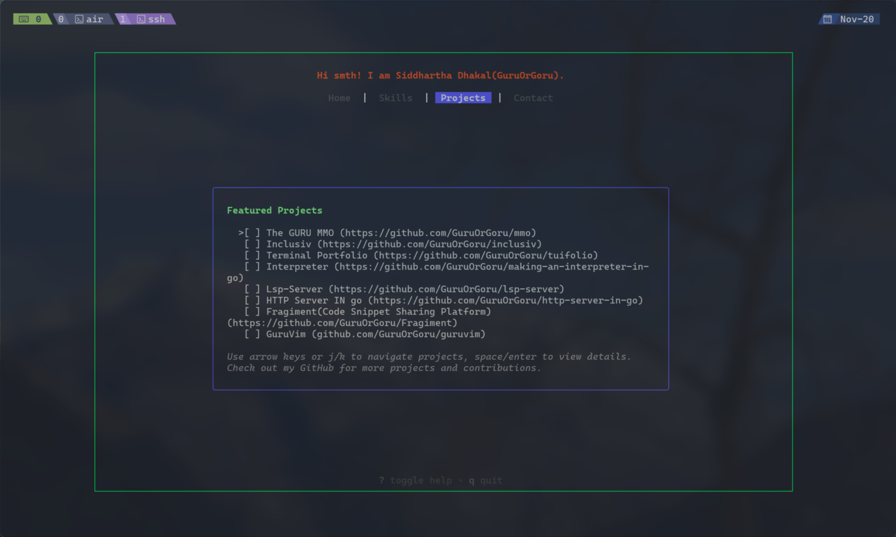
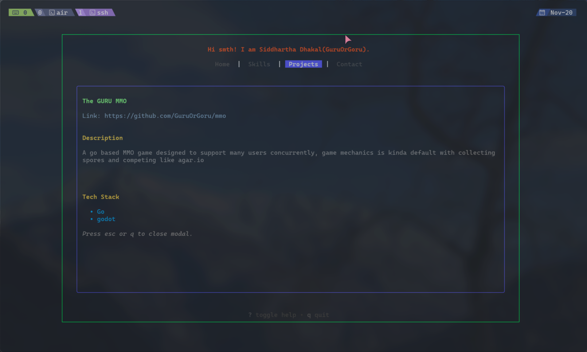
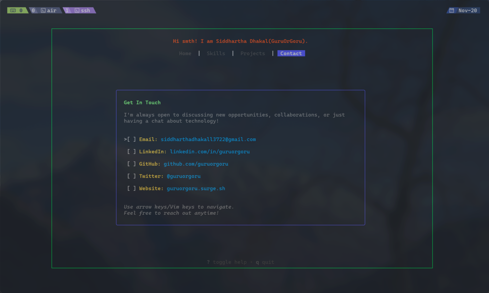
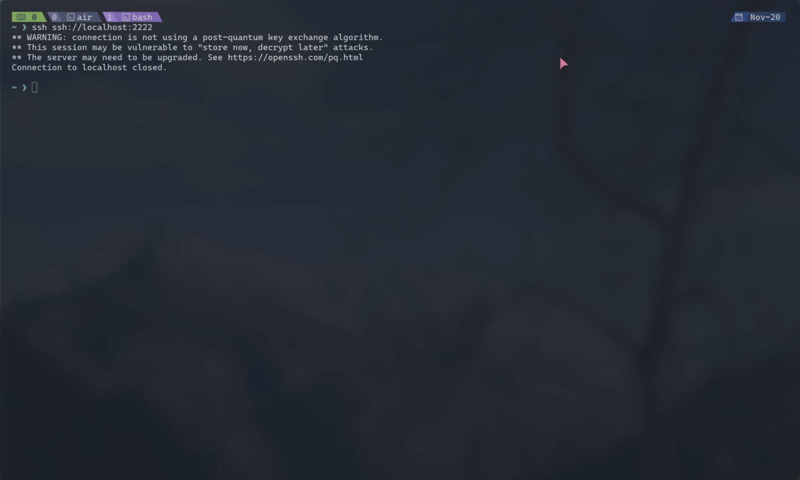

# Tuifolio

## Screenshots











A beautiful, interactive terminal-based portfolio application built with Go and Bubbletea. Tuifolio allows you to showcase your skills, projects, and contact information in a sleek TUI (Terminal User Interface) accessible via SSH.

## Features

- **Interactive TUI**: Navigate through tabs using keyboard shortcuts or mouse
- **SSH Access**: Secure remote access to your portfolio
- **Multiple Sections**:
  - Home: Introduction and interests selection
  - Skills: Expandable skill categories
  - Projects: Browse through your projects with modal details
  - Contact: Get in touch via integrated contact form
- **Responsive Design**: Adapts to different terminal sizes
- **Mouse Support**: Scroll and interact with mouse wheel
- **Keyboard Shortcuts**: Full keyboard navigation support

## Prerequisites

- Go 1.25.1 or later
- SSH client for access

## Installation

1. Clone the repository:
   ```bash
   git clone https://github.com/guruorgoru/tuifolio.git
   cd tuifolio
   ```

2. Install dependencies:
   ```bash
   go mod tidy
   ```

3. Set up environment variables:
   ```bash
   cp .env.example .env
   # Edit .env with your configuration
   ```

4. Generate SSH host key (if not present):
   ```bash
   # The application embeds a host key; ensure host_key file exists in internal/config/
   ```

5. Build the application:
   ```bash
   make build
   ```

## Configuration

Create a `.env` file based on `.env.example`:

```env
# Server Configuration
PORT=2222
HOST=localhost
```

## Usage

1. Start the server:
   ```bash
   make run
   # or
   ./tuifolio
   ```

2. Connect via SSH:
   ```bash
   ssh localhost -p 2222

   or,

   ssh ssh://localhost:2222(if you are a frontend engineer!!)
   ```

3. Enter your username when prompted

4. Navigate using:
   - **Tab/Shift+Tab/H/L/W/B/1234**: Switch between tabs
   - **Arrow Keys/Vim motions(j/k)**: Navigate within tabs
   - **Enter/Space**: Select items
   - **q**: Quit
   - **?**: Toggle help
   - **Mouse**: Scroll and interact

## Development

### Running Tests

```bash
make test
```

### Hot Reload

The project includes Air configuration for hot reloading:

```bash
air
```

### Project Structure

```
internal/
├── config/          # Configuration management
├── ssh/            # SSH server setup
└── tui/            # Terminal UI components
    ├── center.go   # Layout centering
    ├── contact.go  # Contact tab
    ├── header.go   # Header rendering
    ├── help.go     # Help system
    ├── home.go     # Home tab
    ├── input.go    # Input handling
    ├── logo.go     # Logo animation
    ├── model.go    # Main TUI model
    ├── projects.go # Projects tab
    ├── skills.go   # Skills tab
    ├── styling.go  # Styling utilities
    └── types.go    # Type definitions
```

## Key Bindings

| Key | Action |
|-----|--------|
| Tab/L/W | Next tab |
| Shift+Tab/H/B | Previous tab |
| 1/2/3/4 | Corresponding Tab numbers |
| ↑/↓/j/k | Navigate |
| Enter/Space | Select |
| q | Quit |
| ? | Toggle help |
| Ctrl+U/D | Page up/down |
| Mouse Wheel | Scroll |

## Contributing

1. Fork the repository
2. Create a feature branch: `git checkout -b feature/amazing-feature`
3. Commit your changes: `git commit -m 'Add amazing feature'`
4. Push to the branch: `git push origin feature/amazing-feature`
5. Open a Pull Request

## License

This project is licensed under the MIT License - see the [LICENSE](LICENSE) file for details.

## Acknowledgments

- Built with [Charm](https://charm.sh/) libraries: Bubbletea, Bubbles, Lipgloss
- Inspired by modern terminal applications and portfolio websites

## Support

If you encounter any issues or have questions:

- Open an issue on [GitHub](https://github.com/guruorgoru/tuifolio/issues)
- Check the help system within the application (? key)
